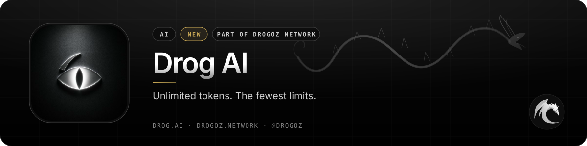
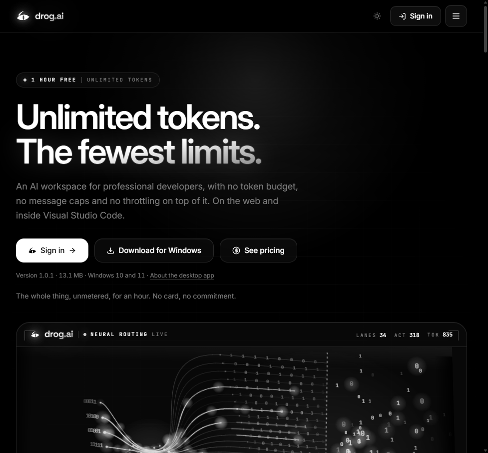
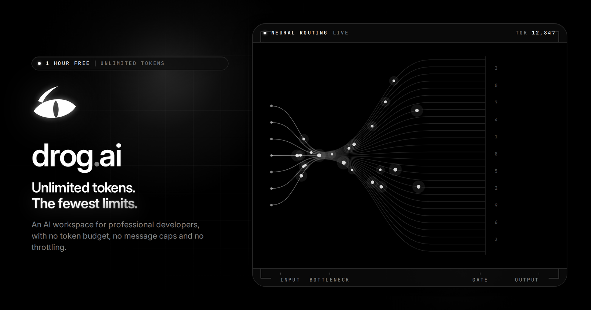
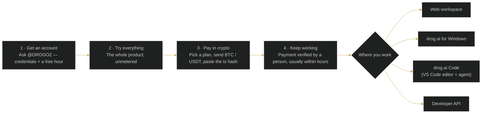

 

# Drog AI

### Unlimited tokens. The fewest limits.

 

  

 

## 📋 Table of contents

- [Overview](#-overview)
- [Key features](#-key-features)
- [Screenshots](#-screenshots)
- [How it works](#%EF%B8%8F-how-it-works)
- [Use cases](#-use-cases)
- [Pricing](#-pricing)
- [Free live demonstration](#-free-live-demonstration)
- [Links](#-links)

## 🧭 Overview

Drog AI (drog.ai) is an AI workspace for professional developers, with no token budget, no message caps and no throttling on top of it. It runs on the web and inside Visual Studio Code, and the service imposes no usage limits of any kind for the length of your subscription — the only boundaries are the capabilities of the model itself and the law that applies where you are.

Nothing is metered: no allowance, no credits, no usage bar to watch. Every request gets the model's full context window, heavy use earns no slow lane or cooldown, and the model and effort you chose are never swapped for a cheaper substitute under load. A month costs what the card says — the price does not follow your usage.

Drog AI ships as a native Windows application and as **drog.ai Code**, a desktop editor with the agent inside it: it reads the repository, plans, edits across files, runs what it wrote and fixes what broke — against your own machine, with the tokens you already pay for. Native Mac (App Store) and Android (Google Play) builds are announced as coming soon.

<table>
<tr>
<td align="center" width="25%"><b>Category</b> AI</td>
<td align="center" width="25%"><b>Status</b> New</td>
<td align="center" width="25%"><b>Bundle</b> Utilities (−2%)</td>
<td align="center" width="25%"><b>Pricing</b> Sign in to see pricing</td>
</tr>
</table>

## ✨ Key features

### ♾️ Unmetered by design

- **No token budget** — nothing is metered. No allowance, no credits, no usage bar to watch.
- **No message caps** — as many messages as the work takes, any hour of the month.
- **The whole context window** — every request gets the model's full context. Nothing is quietly trimmed.
- **No throttling, no queue** — heavy use earns no slow lane, no waiting room and no cooldown.
- **No silent downgrades** — the model and effort you chose, never a cheaper substitute under load.
- **No surprise bill** — a month costs what the card says. The price does not follow your usage.

### 🖥️ Native on Windows

- **drog.ai for Windows** — the whole workspace as a real desktop application (v1.0.1 · 13.1 MB · Windows 10 and 11).
- **Installs without admin rights** — one installer, per user. Nothing to elevate, no runtime to download first, no reboot.
- **The account you already have** — sign in with the same credentials as the web workspace; same conversations.
- **Verifiable before you run it** — every build is published with its SHA-256 digest.

### ⌨️ drog.ai Code — an editor that does the work

- **The whole repository in context** — indexes the project you opened, not just the file you are looking at, and edits across as many files as the change touches.
- **It runs what it writes** — an integrated terminal the agent can drive: build it, test it, read the failure, fix it. You watch and stop it whenever you like.
- **Your machine, your code** — conversations and files stay local. The gateway meters tokens and decides entitlement — it never receives your project.
- **Updates itself, signed** — releases are published with a detached signature and verified before installing (v0.3.3 · Windows 10/11 x64).

### 🧩 Plans & add-ons

- **Free one-hour demo** — the whole thing, unmetered, for an hour. No card, no commitment.
- **Chat** — unlimited tokens in the drog.ai workspace, on the web and over the developer API.
- **Chat + Coder** — everything in Chat plus the coding agent inside Visual Studio Code, repository-wide context and first access to new models.
- **CyberSecurity mode (add-on)** — live penetration-testing tooling and SSH sessions inside drog.ai Code, for hosts you control; requires an authorised-testing acknowledgement.
- **Paid in cryptocurrency** — Bitcoin and Tether.
- **Coming soon** — native macOS app via the App Store and Android via Google Play.

## 📰 Latest update — *The next era of Drog AI* (28 Aug 2026)

> I've built my own AI system — completely independent, unrestricted, and designed without artificial usage limits or censorship. Core capabilities: 2.3 trillion-parameter architecture · advanced neural routing · zero usage restrictions · built for complete freedom and flexibility · available in both conversational and coding editions.
>
> — Drogoz Network, [Updates](https://drogoz.network/#updates)

## 🖼️ Screenshots

> Product images from [drog.ai](https://drog.ai/) and the [service page](https://drogoz.network/services/drogai/) on drogoz.network.

<table>
<tr>
<td width="50%" align="center"> drog.ai — Unlimited tokens. The fewest limits.</td>
<td width="50%" align="center"> drog.ai workspace preview</td>
</tr>
</table>

## ⚙️ How it works

**An hour free, then a month at a time**

## 🎯 Use cases

<table>
<tr>
<td width="50%" valign="top"><b>👩‍💻 Professional developers</b> Long agentic sessions without watching a usage bar — the full context window on every request.</td>
<td width="50%" valign="top"><b>🏗️ Repository-wide refactors</b> drog.ai Code indexes the whole project and edits across as many files as the change touches.</td>
</tr>
<tr>
<td width="50%" valign="top"><b>🧪 Build–test–fix loops</b> The agent drives an integrated terminal: build it, test it, read the failure, fix it.</td>
<td width="50%" valign="top"><b>🛡️ Authorised security testing</b> The CyberSecurity add-on brings recon, scanning and exploitation tooling plus SSH sessions into the editor — for hosts you control.</td>
</tr>
<tr>
<td colspan="2" valign="top"><b>🔌 API workloads</b> The developer API runs under the same unlimited terms as the workspace.</td>
</tr>
</table>

## 💳 Pricing

> **Sign in at [drogoz.network](https://drogoz.network/accounts/login/) to see pricing.** Your exact monthly cost, in seconds — no quotes, nothing hidden.

Drog AI is part of the **Utilities** bundle (−2%) — *Core utility tools* — and of **All In One** (−10%) — *Every product, best price*. Take several products together and save more: [Packages & bundles](https://drogoz.network/#packages) · [Pricing & calculator](https://drogoz.network/pricing/).

| Bundle | Discount | Included |
|---|---|---|
| **Utilities** | −2% | Drog AI, MyMask AI, Replika, IMPERATORI, RiderSwap, Vadira, Skriper |
| **All In One** | −10% | Drog AI, MyMask AI, Replika, Lidaro AI, IMPERATORI, ZOI Talks, RiderSwap, HyperBlast AI, VerifHub AI, Vadira, Skriper |

## 🎥 Free live demonstration

**A live demonstration is 100% free on every product.** 
See Drog AI in action before you pay — our agent gets in touch and walks you through a live demonstration.

Registration is handled by our team — get in touch and receive personal access.

## 🔗 Links

| Channel | Link |
|---|---|
| 🌐 **Website** | [drog.ai](https://drog.ai/) |
| 📄 **Details page** | [drogoz.network/services/drogai/](https://drogoz.network/services/drogai/) |
| ✈️ **Telegram group** | [@drog_ai](https://t.me/drog_ai) |
| 🏛️ **Drogoz Network** | [drogoz.network](https://drogoz.network) · [Services](https://drogoz.network/#services) · [Packages](https://drogoz.network/#packages) · [Pricing](https://drogoz.network/pricing/) · [Presentation](https://drogoz.network/presentation/) |
| ⚖️ **Legal** | [Terms of Service](https://drogoz.network/legal/terms-of-service/) · [Acceptable Use](https://drogoz.network/legal/acceptable-use-policy/) · [Privacy](https://drogoz.network/legal/privacy-policy/) · [Refunds](https://drogoz.network/legal/refund-policy/) · [Disclaimer](https://drogoz.network/legal/disclaimer/) · [Compliance](https://drogoz.network/legal/compliance-policy/) |
| 🐙 **GitHub** | [deepdrogo](https://github.com/deepdrogo/deepdrogo) |

 

   
  
    
  <b>Made by <a href="https://drogoz.network">Drogoz Network</a></b> 
  One network — all your services · Premium SaaS Network
    
  
  
  
  
    
  <b>More from the network:</b> <a href="https://github.com/deepdrogo/mymask-ai">MyMask AI</a> · <a href="https://github.com/deepdrogo/replika">Replika</a> · <a href="https://github.com/deepdrogo/lidaro-ai">Lidaro AI</a> · <a href="https://github.com/deepdrogo/imperatori">IMPERATORI</a> · <a href="https://github.com/deepdrogo/zoi-talks">ZOI Talks</a> · <a href="https://github.com/deepdrogo/riderswap-io">RiderSwap</a> · <a href="https://github.com/deepdrogo/hyperblast-ai">HyperBlast AI</a> · <a href="https://github.com/deepdrogo/verifhub-ai">VerifHub AI</a> · <a href="https://github.com/deepdrogo/vadira-net">Vadira</a> · <a href="https://github.com/deepdrogo/skriper-io">Skriper</a>
    
  © 2026 Drogoz Network. All rights reserved. Provided strictly for lawful use — see the <a href="https://drogoz.network/legal/">Legal Center</a>. Each user is solely responsible for how they use the software.

